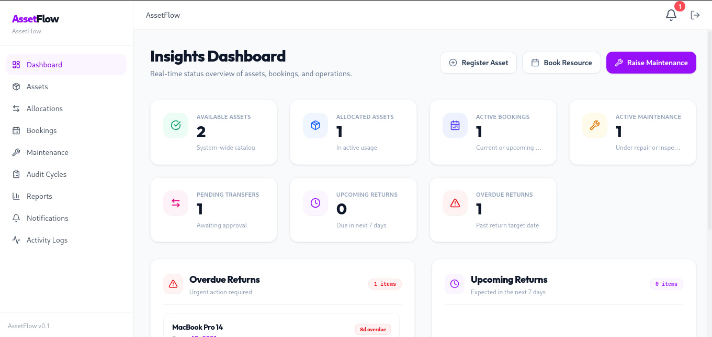
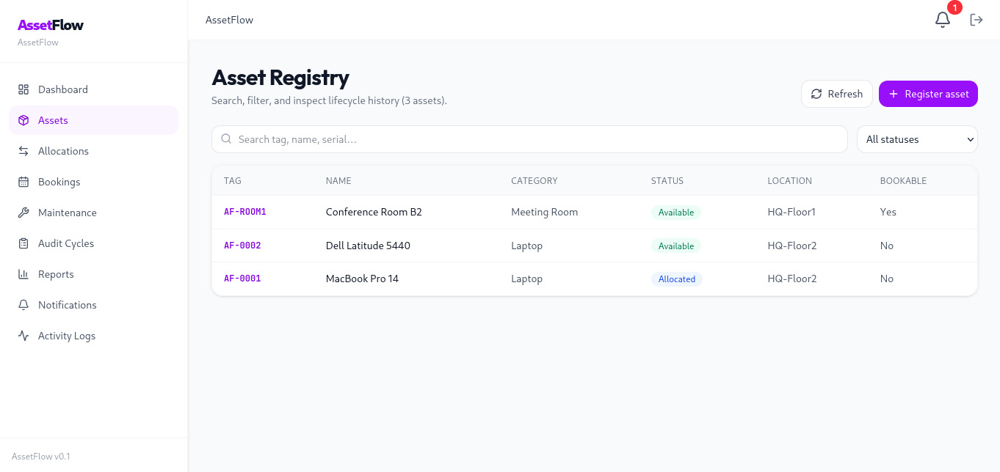
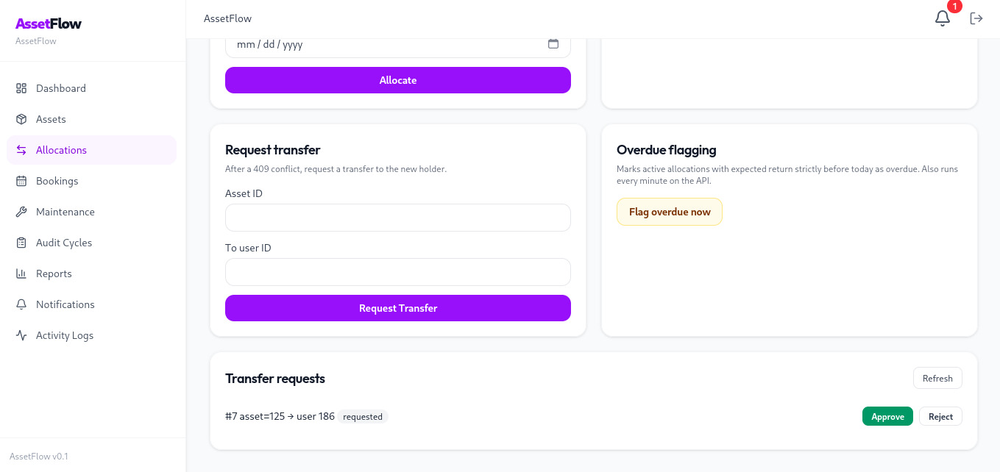
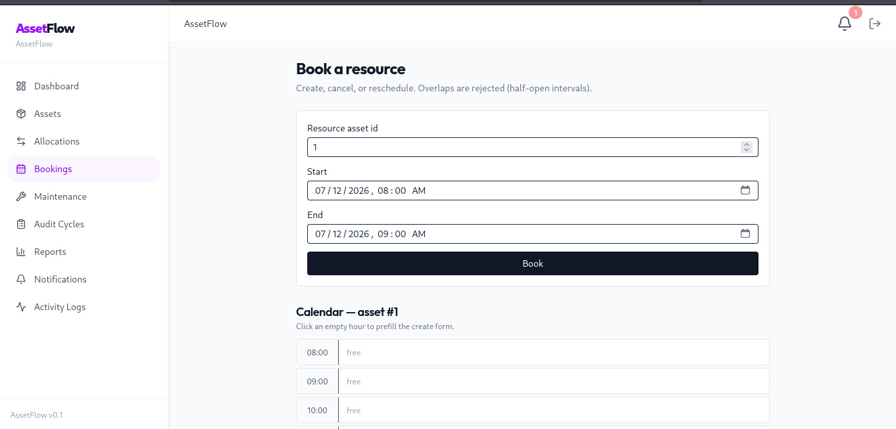
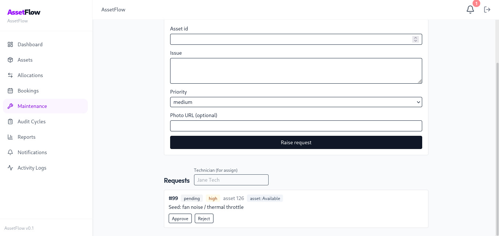
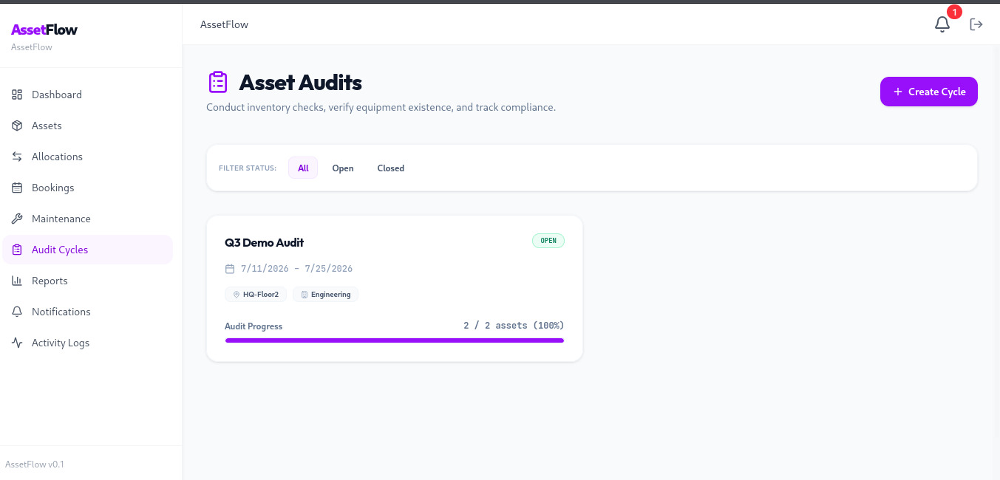
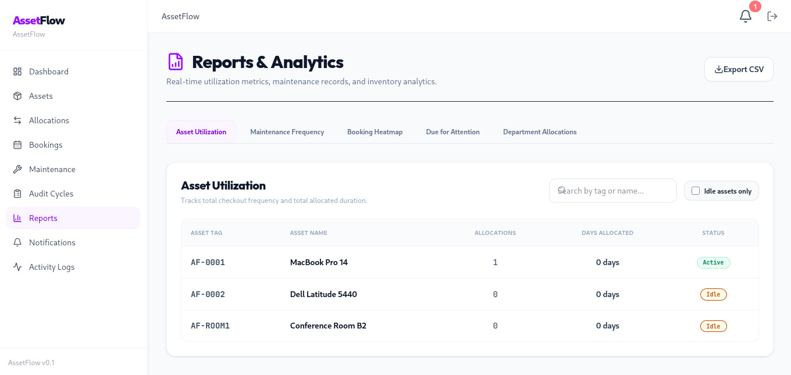
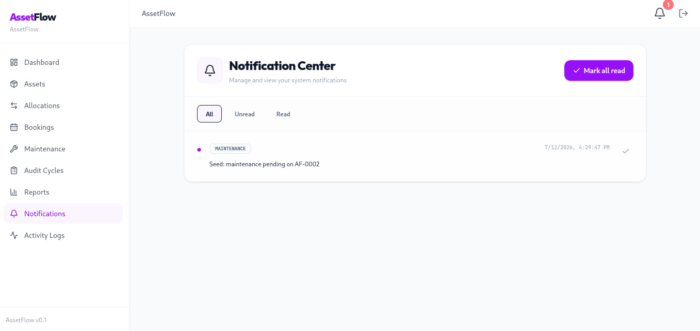
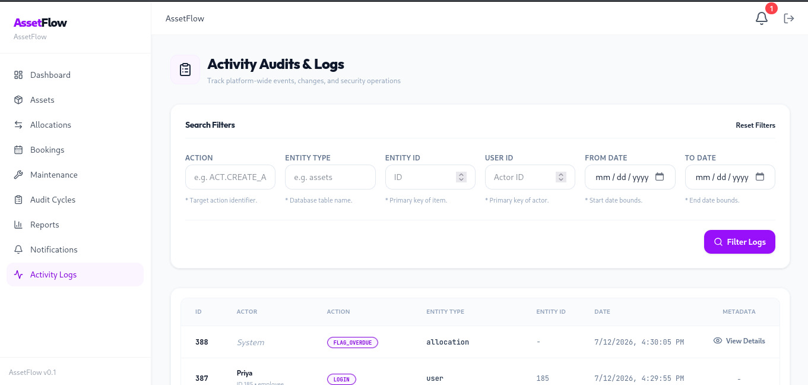
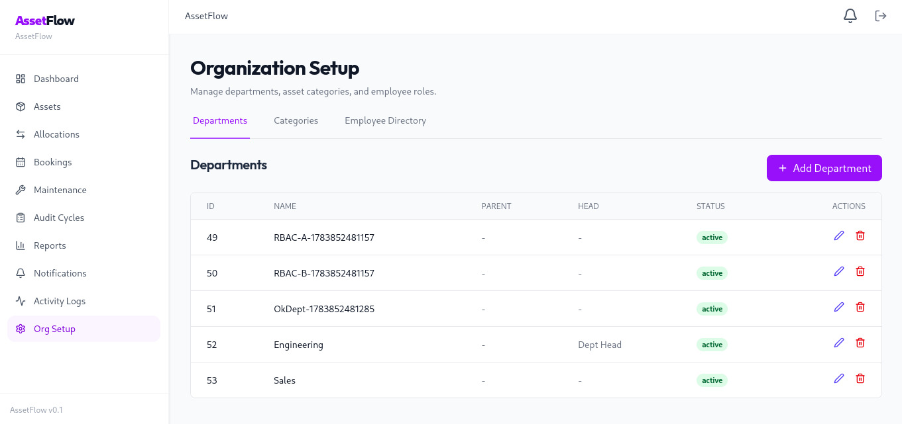

# 📦 AssetFlow

**Enterprise Asset & Resource Management System**  
*Built by Lazy Monks for the Hackathon*

AssetFlow is a comprehensive, feature-sliced enterprise platform designed to manage organizational assets, roles, resource bookings, and maintenance life-cycles. It enforces strict domain logic with believable Role-Based Access Control (RBAC), ensuring that asset allocation, transfer, and maintenance are handled securely and efficiently.

---

## ✨ Key Features & The "3 Hard Rules"

AssetFlow features 10 core screens spanning Authentication, Dashboards, Organizational Setup, Asset Registration, Allocation, Bookings, Maintenance, Auditing, and Reporting. 

To ensure absolute data integrity, the system strictly enforces **3 Hard Rules**:

1. **No Double Allocation**: If an active allocation exists, any attempt to re-allocate results in a `409 CONFLICT`, prompting a formal "Transfer Request" workflow.
2. **Booking Overlap Prevention**: Resource bookings (e.g., meeting rooms) enforce strict half-open `[start, end)` time intervals. Overlapping bookings are rejected instantly.
3. **Maintenance Gating**: Assets can only enter the `Under_Maintenance` status through an approved maintenance workflow, preventing unauthorized manual status overrides.

---

## 🛠️ Technology Stack

Our robust, single-stack architecture ensures developer velocity and type safety across the board:

- **Backend**: Node.js (20+), Express.js
- **Database & ORM**: PostgreSQL 16, Prisma
- **Frontend**: React 18, Vite, Tailwind CSS, TanStack Query, React Router v6
- **Language**: TypeScript throughout
- **Testing**: Vitest (Unit) & Supertest (Integration)
- **Architecture**: Monorepo via npm workspaces (`backend/` & `frontend/`)

---

## 🚀 Getting Started (Local QA)

Follow these steps to run the entire stack locally for development and testing.

### Prerequisites
- Node **20+**, npm **10+**
- **Docker** (Desktop or Engine) for PostgreSQL

### One-Time Setup

```bash
# 1. Clone and install dependencies
git clone git@github.com:nikhil-r0/assetflow-lazy-monks.git
cd assetflow-lazy-monks
git checkout develop && git pull
npm install

# 2. Start PostgreSQL via Docker (maps to port 5434 to avoid conflicts)
docker compose up -d

# 3. Configure backend environment variables
cp backend/.env.example backend/.env
# Note: Ensure DATABASE_URL in .env uses localhost:5434

# 4. Deploy schema and seed the database
cd backend
npx prisma migrate deploy
npx prisma generate
npm run seed  # Safe to run multiple times
```

### Running the Application

You will need two terminals to run the API and UI concurrently.

**Terminal 1 (Backend API):**
```bash
cd backend
npm run dev
# API running at http://localhost:4000
```

**Terminal 2 (Frontend UI):**
```bash
cd frontend
npm run dev
# UI running at http://localhost:5173
```

### Seed Accounts
Log in at `http://localhost:5173` with any of the following seeded accounts. **Password for all users is `Passw0rd!`**

| Email | Role |
|---|---|
| `admin@assetflow.dev` | Admin |
| `manager@assetflow.dev` | Asset Manager |
| `head@assetflow.dev` | Department Head |
| `employee@assetflow.dev` (Priya) | Employee |
| `sales@assetflow.dev` (Raj) | Employee |

### Troubleshooting / Common Issues

If you see an error about `@prisma/client` missing an export or not being found when running `npm run seed` or `npm run dev`, it means the Prisma Client wasn't generated. You can fix this by running:

```bash
cd backend
npx prisma generate
```

---

## 🖼️ Screens

Screenshots live in [`docs/screenshots/`](docs/screenshots/).

### 1. Dashboard


### 2. Assets


### 3. Allocations


### 4. Bookings


### 5. Maintenance


### 6. Audit Cycles


### 7. Reports


### 8. Notifications


### 9. Activity Logs


### 10. Org Setup


---

## 📚 Documentation Reference

For developers and agents working on the repository, refer to the following internal documentation:

- **[`BUILD_SPEC.md`](./BUILD_SPEC.md)**: The build bible containing schema, RBAC rules, APIs, phases, and tests. *(This is the ultimate authority for code)*
- **[`ASSETFLOW.md`](./ASSETFLOW.md)**: Guide to winning the hackathon—thesis, rules, demo script, and DoD.
- **[`AssetFlow_Hackathon_Plan.md`](./AssetFlow_Hackathon_Plan.md)**: The 8-hour execution schedule and ownership breakdown.
- **[`STATUS.md`](./STATUS.md)** (or Issue #12): Live tracker of what is currently on `develop` and what remains to be done.

---

## 🏗️ Hackathon Tracks

The project is split into 4 parallel tracks to maximize efficiency during the 8-hour build:

| Track | Focus | Core Responsibilities |
|---|---|---|
| **A (Auth/Org)** | Auth & Master Data | Login/Signup, JWT RBAC, Departments, Categories, Role Promotion |
| **B (Assets)** | Core Asset Lifecycle | Asset Registry, Allocations, Transfers, Overdue tracking (Rule 1) |
| **C (Ops)** | Bookings & Maintenance| Calendar overlaps (Rule 2), Maintenance gate state machine (Rule 3) |
| **D (Insights)**| Analytics & Auditing | Dashboards, KPIs, Audit Discrepancies, Reports, Notifications |

---

> **Note on Branching:** All active work should branch from `develop`. The `main` branch is reserved for tagged, demo-safe checkpoints.
